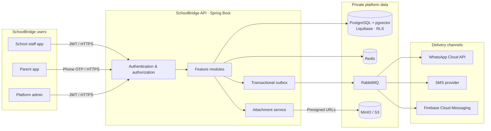
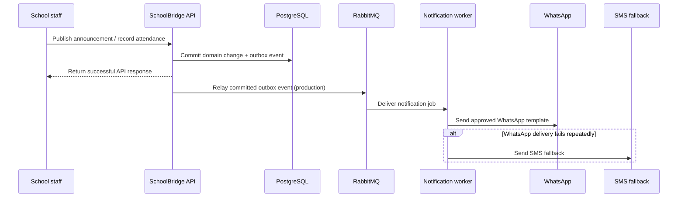
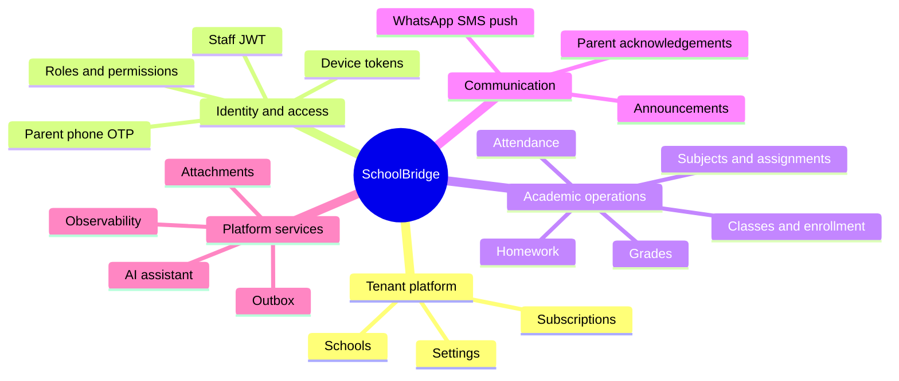
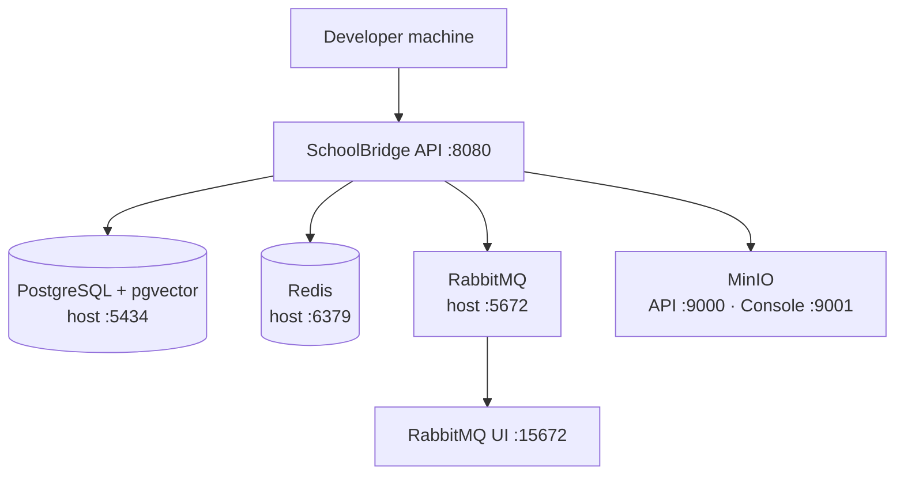
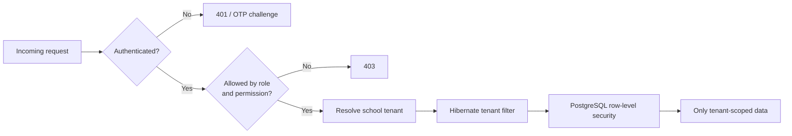

<div align="center">

# SchoolBridge API

### A secure, WhatsApp-first communication backbone for modern schools

Multi-tenant Spring Boot API for announcements, attendance, homework, grades, and dependable parent communication.

`Java 21` · `Spring Boot 3.4` · `PostgreSQL + pgvector` · `RabbitMQ` · `Redis` · `MinIO / S3`

</div>

---

## Purpose

SchoolBridge gives school teams one trusted backend for parent-facing operations: publish a notice, record attendance, assign homework, share a grade, or send a secure attachment. It is designed around tenant isolation, bilingual communication, and reliable delivery.

| Built for | What it enables |
| --- | --- |
| **School teams** | Manage schools, staff, rosters, subjects, announcements, attendance, homework, and grades. |
| **Parents** | Authenticate by phone and OTP; receive notices; acknowledge announcements; view child information. |
| **Platform operators** | Onboard tenants, operate integrations, observe health, and enforce least-privilege data access. |

## At a glance

| Area | Highlights |
| --- | --- |
| 🏫 Multi-tenancy | Hibernate tenant scoping plus PostgreSQL row-level security (RLS). |
| 🔐 Identity | JWT for staff; phone + OTP for parents; role- and permission-based authorization. |
| 📣 Communication | Announcements, attendance alerts, homework reminders, WhatsApp, SMS fallback, and push notifications. |
| 📎 Attachments | S3-compatible storage, presigned URLs, byte-level content checks, and production AV enforcement. |
| 🤖 Assistant | Optional tenant-aware AI assistant with tool calling and RAG; disabled by default. |
| 🌍 Language | English and Arabic message bundles for user-facing strings. |

## System architecture



## Notification delivery



## Feature map



## Quick start

### Prerequisites

- JDK 21
- Maven 3.9+
- Docker Desktop or another Docker-compatible engine

### 1. Configure and start local services

Copy the environment template, complete the Docker Compose credentials that are intentionally blank, and start PostgreSQL, RabbitMQ, Redis, and MinIO.

```powershell
Copy-Item .env.example .env
docker compose up -d
```

### 2. Run the API

The `local` profile is the default. It uses disposable local development settings and stubs external messaging until provider credentials are supplied.

```powershell
$env:JAVA_HOME = 'C:\Program Files\Java\jdk-21'
$env:Path = "$env:JAVA_HOME\bin;$env:Path"
mvn -B -ntp spring-boot:run -Dspring-boot.run.profiles=local
```

### 3. Explore it

| Service | Local address |
| --- | --- |
| API / Swagger UI | <http://localhost:8080/swagger-ui.html> |
| OpenAPI JSON | <http://localhost:8080/v3/api-docs> |
| Health | <http://localhost:8080/actuator/health> |
| Prometheus metrics | <http://localhost:8080/actuator/prometheus> |
| RabbitMQ management | <http://localhost:15672> |
| MinIO console | <http://localhost:9001> |

> [!IMPORTANT]
> The local profile’s committed crypto defaults are for disposable development data only. Never point it at real data. Production requires environment-supplied keys, credentials, and separate database roles.

## API domains

All application endpoints are versioned below `/api/v1`.

| Domain | Covers |
| --- | --- |
| `tenant` | School onboarding, status, subscriptions, and per-school settings. |
| `identity` | Staff users, roles, permissions, JWT login, parent OTP login, and device tokens. |
| `classes` | Classes, students, enrollment, parent-child links, and roster import. |
| `subjects` | Subject catalog, class assignments, and teacher assignments. |
| `announcements` | Publishing, targeting, scheduling, delivery tracking, and acknowledgement. |
| `attendance` | Roster marking, history, absence/late alerts, and parent responses. |
| `homework` / `grades` | Homework, reminders, due dates, grade records, and parent read access. |
| `attachments` | Authorized presigned upload/download and attachment lifecycle. |
| `assistant` | Optional conversations, tool use, knowledge ingestion, and tenant settings. |

## Local topology



Stop the local services with `docker compose down`.

## Profiles and configuration

| Profile | Intended use | Key behavior |
| --- | --- | --- |
| `local` | Day-to-day development | Docker Compose dependencies, disposable development crypto, debug logging, and stubbed messaging unless configured. |
| `test` | Automated tests | Testcontainers starts PostgreSQL, RabbitMQ, Redis, and MinIO; sweepers and rate limits are disabled for determinism. |
| `prod` | Deployment | Environment-only secrets, outbox relay enabled, Swagger disabled, AV scanning required, and separate runtime/migration database users. |

Copy `.env.example` to `.env` to see the complete infrastructure and secrets contract. Production particularly needs `AES_KEY`, `BLIND_INDEX_KEY`, `DB_*`, `DB_MIGRATION_*`, `STORAGE_*`, messaging credentials, and—only when approved—assistant provider credentials.

Generate a 32-byte base64 key with:

```shell
openssl rand -base64 32
```

## Security model



- Tenant-owned entities are isolated by application-level filtering and PostgreSQL RLS policies.
- Production uses separate runtime and Liquibase database roles; startup validation rejects an app account that can bypass RLS.
- Clients get short-lived attachment URLs only after authorization. File bytes are sniffed against an allowlist, and AV scanning is mandatory in production.
- Secrets are environment-supplied; error responses exclude messages and stack traces.
- Redis backs blanket traffic limits plus targeted login and OTP quotas.

## Optional AI assistant

The assistant is intentionally opt-in:

```dotenv
ASSISTANT_ENABLED=false
ASSISTANT_ACTIONS_ENABLED=false
ASSISTANT_RAG_ENABLED=false
SPRING_AI_CHAT=none
```

When explicitly enabled, it provides tenant-aware conversations, constrained tool calling, confirmation flows, and pgvector-backed knowledge retrieval. Review data-processing implications before sending school data to a third-party inference provider.

## Build and test

```shell
# Fast compilation check
mvn -B -ntp -DskipTests compile

# Full completion gate: tests, formatting, static analysis, and coverage
mvn -B -ntp verify
```

`mvn verify` runs the test suite, Spotless (Google Java Format, 2-space indentation), SpotBugs, and JaCoCo reporting. Integration tests use Testcontainers and validate real Liquibase migrations, authorization, tenant isolation, RLS, notifications, attachment safety, and assistant guardrails.

## Project layout

```text
src/
├── main/java/com/schoolbridge/api/
│   ├── announcements/  assistant/  attachments/  attendance/
│   ├── classes/        common/     grades/       homework/
│   ├── identity/       integrations/ subjects/    tenant/
│   └── config/
├── main/resources/
│   ├── db/changelog/          # Liquibase migrations
│   ├── application*.yml       # Profile configuration
│   └── messages_*.properties  # Arabic and English messages
└── test/                      # Unit, integration, RLS, and architecture tests
```

## Production checklist

- [ ] Runtime and migration database users are distinct; the runtime user cannot bypass RLS.
- [ ] Keys, provider credentials, and storage credentials are supplied by the deployment environment or secret manager.
- [ ] Object storage is private and production AV scanning is reachable.
- [ ] WhatsApp templates are approved; SMS fallback and FCM are configured if used.
- [ ] The assistant remains disabled until its data-processing decision and provider setup are approved.
- [ ] Health, metrics, tracing, logs, and backup/recovery procedures are connected to the operating environment.

## Contributing

1. Keep work scoped to a package-by-feature module.
2. Add or update tests with behavior changes.
3. Run `mvn -B -ntp verify` before opening a change.
4. Do not commit secrets, production keys, or real school data.

---

<details>
<summary>Legacy implementation notes</summary>

SchoolBridge is a multi-tenant backend for school-to-parent communication. It supports
school operations, parent authentication, announcements, attendance, homework, grades,
attachments, and notification delivery.

Each tenant-owned record is isolated by a Hibernate filter and PostgreSQL row-level
security. Arabic and English user-facing strings are resolved from message bundles.

## Features

- Tenant-isolated school, staff, student, class, subject, attendance, homework, and grade data
- JWT authentication for staff and phone/OTP authentication for parents
- Role and permission-based authorization
- Announcements, attendance alerts, homework reminders, WhatsApp delivery, SMS fallback, and push notifications
- S3-compatible attachments with content checks and optional anti-virus scanning
- Optional assistant with tool calling and retrieval-augmented responses, disabled by default

## Tech Stack

| | |
|---|---|
| Runtime | Java 21, Spring Boot 3.4 |
| Data | PostgreSQL 16 (+ pgvector), Liquibase, Redis, RabbitMQ |
| Auth | JWT for staff, phone + OTP for parents, DB-backed RBAC |
| Integrations | WhatsApp Cloud API (Meta), SMS fallback, FCM |
| Observability | Actuator, Micrometer/Prometheus, OpenTelemetry |
| Tests | JUnit 5, Testcontainers, RestAssured |

## Modules

Package-by-feature under `com.schoolbridge.api`:

| Module | Responsibility |
|---|---|
| `common` | Shared utilities, base entities, tenancy, crypto, outbox, audit, error handling |
| `config` | Spring configuration and app wiring |
| `tenant` | School onboarding, per-school settings |
| `identity` | Users, roles, JWT + OTP authentication, device tokens |
| `classes` | Classrooms, students, parent↔child links |
| `subjects` | Per-school subject catalog |
| `grades` | Grade records |
| `announcements` | School announcements, targeting, acknowledgement |
| `attendance` | Attendance records, absence alerting, reports |
| `homework` | Homework items, recipients, reminders |
| `integrations` | WhatsApp / SMS / push adapters, outbox consumers |
| `assistant` | AI assistant (tool-calling + RAG) — **off by default**, see ADR-007 |

## Quick start

Requires JDK 21, Maven 3.9+, and a Docker-compatible engine.

Copy `.env.example` to `.env` and provide the required datastore credentials before
starting Docker Compose. Production additionally requires encryption, database,
messaging, and storage credentials through environment variables.

```powershell
Copy-Item .env.example .env
docker compose up -d
$env:JAVA_HOME = 'C:\Program Files\Java\jdk-21.0.12'
$env:Path = "$env:JAVA_HOME\bin;$env:Path"
mvn -B -ntp spring-boot:run -Dspring-boot.run.profiles=local
```

The `prod` profile requires `AES_KEY` and `BLIND_INDEX_KEY`; it will not start without
them. The `local` profile has disposable development defaults so a fresh checkout can
start against the local Docker database. Do not reuse those defaults for real data;
generate throwaway values with `openssl rand -base64 32` when needed.

The assistant is disabled by default. Enable it only after configuring a supported
provider and reviewing the data that may be sent to that provider.

API docs at `http://localhost:8080/swagger-ui.html` (disabled in `prod`).

## Building

```shell
mvn -B -ntp -DskipTests compile   # fast compile check
mvn -B -ntp verify                # full build: tests + Spotless + SpotBugs
```

Spotless (google-java-format, 2-space indent) and SpotBugs are **hard gates**, not
advisory. `mvn -B -ntp verify` must be green before any module change is considered
done.

## Environment Profiles

| Profile | Assumes |
|---|---|
| `local` | Everything from `docker-compose.yml`; dev crypto keys inline; message clients stubbed unless credentials are supplied |
| `test` | Testcontainers-provided Postgres/Redis/RabbitMQ; rate limiting and sweepers disabled so tests are deterministic |
| `prod` | All secrets from the environment; Swagger off; **two DB roles** — see the deployment configuration and CI workflow. |

## Tests

Integration tests extend `AbstractIntegrationTest`, which starts Postgres, RabbitMQ
and Redis once per JVM via the Testcontainers singleton-container pattern and runs
every Liquibase changeset against real PostgreSQL on each boot. That is also what
validates the changelog — there is no separate migration lint step.

Cross-tenant isolation is asserted per repository, plus an ArchUnit rule that fails
the build if a `TenantEntity` repository is missing its `findById` override, plus
`TenantRlsIntegrationTest` which proves the database policies hold for an
unprivileged role.

## Database

PostgreSQL is the primary database. Liquibase applies migrations from
`src/main/resources/db/changelog`; local Docker Compose starts PostgreSQL with pgvector,
Redis, RabbitMQ, and MinIO.

## Docker

Start local dependencies with `docker compose up -d` and stop them with
`docker compose down`.

## Project Structure

```text
src/
  main/
  test/
.env.example
docker-compose.yml
Dockerfile
pom.xml
README.md
```

## Security

- JWT and OTP authentication
- Role and permission-based authorization
- PostgreSQL row-level security for tenant data
- Environment-based credentials and encryption keys
- Presigned attachment URLs with type validation and production anti-virus enforcement

</details>

<div align="center">

Built for dependable school-to-parent communication — with privacy and tenant safety at the center.

</div>
